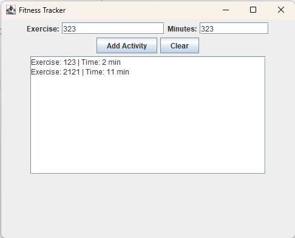

# 💪 Fitness Tracker

Полнофункциональное приложение для отслеживания тренировок на Java Swing.

## ✨ Особенности

• 🏃 Добавление тренировок  
• ⏱ Указание времени занятий  
• 📋 Просмотр списка тренировок  
• 🗑 Очистка списка

## 🚀 Быстрый запуск

1. Скачать проект
2. Открыть в IntelliJ IDEA
3. Запустить файл FitnessTracker.java
4. Использовать приложение

## 📷 Скриншоты

## 🛠 Технологии

• Java  
• Java Swing  
• AWT

